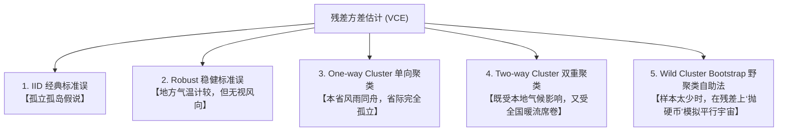

# 📖 BDM (2004) 聚类模拟学术评述与蒙特卡洛直觉透析

本文件作为实证经济学交互实验室沙盒的理论基石，旨在用**最具启发性、无AI腔**的纯学术与直观逻辑，为你彻底拆解“聚类标准误”这一现代计量推断的支柱。

---

## 1. 🎲 蒙特卡洛模拟（Monte Carlo）的底层人话直觉

在现实世界中，我们常常被各种计量术语（如“假阳性”、“稳健性”、“渐近有效”）搞得头晕目眩。要理解它们，最简单也是最强大的武器，就是**蒙特卡洛模拟（Monte Carlo Simulation）**。

### 什么是蒙特卡洛？—— 计算机里的“平行宇宙体检”
* **现实的局限**：在现实的实证研究中，历史只发生了一次，我们手里只有**一份**数据集。我们试图估计政策效应 $\beta$，但由于数据里有噪音，我们算出来的 $\hat{\beta}$ 到底是因为政策真的有用，还是只是运气好（噪音正好凑在了一起）？我们无从得知。
* **蒙特卡洛的超能力**：我们在计算机里扮演“上帝”，人为地创造出一个**虚拟的平行宇宙**。在这个宇宙里，所有的规则都是我们用代码定死的：
  1. 我们明确设定：**真实政策效应 $\beta$ 恰好等于 0**（即政策完全是一剂无用的生理盐水，$H_0: \beta = 0$ 绝对成立）。
  2. 我们让计算机在这个宇宙里模拟运转 1000 次（生成 1000 个平行宇宙的历史数据）。
  3. 在每一个平行宇宙里，我们都用不同的标准误方法去算 $t$ 统计量，并进行显著性检验（看 $p < 0.05$ 是否成立）。

### 什么是“推断失效”与“过度拒绝”？
* **诚实的推断方法**：由于我们设定的名义显著性水平是 $\alpha = 0.05$（即允许 5% 的误诊率），如果一个标准误公式是“诚实、正确”的，那么在 1000 个平行宇宙中，它应该**有且仅有大约 50 次（5%）**错误地判定政策显著（这叫**假阳性/第一类错误**）。
* **骗子推断方法（BDM的发现）**：当我们使用传统的 OLS 标准误时，在 1000 个平行宇宙中，它竟然有**接近 450 次（45%）**言之凿凿地宣称“政策极其显著，生理盐水包治百病”！
* **结论**：这就是“45%过度拒绝”的震撼之处——它用无可辩驳的蒙特卡洛实验证明，传统的标准误算法在时间序列自相关下一直在“说谎”，其误诊率高出了正常标准近 9 倍！

---

## 2. 📝 BDM (2004) 论文信息与方法论革命

### 📌 原始文献信息
* **标题**：*How Much Should We Trust Differences-in-Differences Estimates?* (我们应该在多大程度上信任双重差分估计？)
* **作者**：Marianne Bertrand, Esther Duflo (2019年诺贝尔经济学奖得主), Sendhil Mullainathan
* **期刊**：*Quarterly Journal of Economics* (QJE), 2004, Vol. 119, No. 1.

### 💡 核心发现与方法论革命
在 BDM (2004) 发表之前，实证经济学界在使用双重差分法（DID）评估政策时，几乎无一例外地使用传统的 OLS 标准误或 Huber-White 稳健标准误（Robust SEs）。

BDM 通过上述的蒙特卡洛平行宇宙实验，首次揭示了一个灾难性的物理事实：
1. **时间序列相关性（Serial Correlation）**：绝大多数宏观、区域经济变量（如各省 GDP、失业率、工资水平）都具有极强的**路径依赖**（今天的状况严重受昨天影响，即误差项 $\epsilon_{it}$ 存在自相关）。
2. **政策分配的粗粒度性**：大多数政策都是在“省份”或“行业”级别（Cluster 级别）统一实施的，且一旦实施就会持续很多年。
3. **推断崩溃**：高度持续的政策变量与高度持续的自相关误差项相乘，导致 OLS 严重低估了残差的标准差。BDM 证明，即使政策效应完全为 0，实际拒绝率也会飙升至 **45%**！

**这篇论文彻底改变了实证经济学的游戏规则**：自此之后，在政策分配的层级进行**聚类调整标准误（Clustered Standard Errors）**，成为了全球顶尖期刊发表论文的**强制性硬性门槛**。

---

## 3. 🧩 复杂术语背后的数理物理直觉

为了让你彻底摆脱死记硬背，我们用最直观的物理直觉来剖析以下 5 种推断方法：

### ① IID 经典标准误：孤立孤岛假说
* **逻辑**：假设所有的观测样本点都是宇宙中完全孤立的岛屿。第 $i$ 个省份在 $t$ 年份发生的随机冲击，跟该省份在 $t-1$ 年份的冲击毫无关联。
* **物理直觉**：相当于认为“你今天的感冒”和“你昨天的感冒”是两件完全独立的、随机掷硬币事件。这显然违背了客观规律，导致估计出来的标准误差小得可怜，极易判定显著。

### ② Robust 稳健标准误 (Huber-White)：地方气温计较，但无视风向
* **逻辑**：允许不同个体的残差方差不一样（异方差），但仍然坚信个体之间的误差是完全独立的（非对角线全部为 0）。
* **物理直觉**：承认“有些省份经济波动大（气温变化剧烈），有些省份波动小”，但仍然认为“你省份昨天的气温”不会吹向“今天”。因此，**稳健标准误在时间序列自相关面前彻底失效，假阳性率依然维持在 40% 左右**。

### ③ One-way Clustered SE 单向聚类标准误：省内风雨同舟，省际完全孤立
* **逻辑**：把数据按省份（Cluster）分组。允许**同一个省份内部**的所有个体、所有年份之间的残差存在**任意形式**的序列相关和异方差（方差-协方差矩阵的组内非对角块完全释放，不设限制）；但要求**不同省份之间**必须彻底独立。
* **物理直觉**：承认“同一个省份的气候是高度自我相关的，一损俱损”。它把同一个省份的 10 年数据不再看作 10 个独立信息，而是合并压缩成一个整体信息包。这虽然减少了名义样本量，但挤掉了泡沫，拽回了最诚实的 5% 拒绝率。

### ④ Two-way Clustered SE 双重聚类标准误：本地气候与全国暖流交织
* **逻辑**：如果数据不仅在“省份”内部相关，在“年份”层面上（如某一年全国爆发了金融危机或疫情）也存在全样本的交叉相关，该怎么办？双重聚类同时在 `id`（个体）和 `t`（时间）两个维度进行对角块释放：
  $$V_{2way} = V_{id} + V_{t} - V_{id \cap t}$$
* **物理直觉**：既允许你和你的邻居（空间/省份）同呼吸共命运，也允许你和全国人民在特定历史时刻（时间/年份）同频共振。

### ⑤ Wild Cluster Bootstrap 野聚类自助法：小样本下的残差“抛硬币”模拟
* **逻辑**：当你的**聚类组数太少**（例如只有 10 个省份，或者实施政策的治疗组省份只有 1 个）时，渐近大样本理论失效，常规聚类标准误会急剧退化并严重过拒。Wild Bootstrap 会利用当前样本估计出的残差，通过乘以一个随机的拉德马赫权重（Rademacher weight, 只有 +1 和 -1，各 50% 概率，如同抛硬币），来强行“扰动”并重新构造数千个自助样本。
* **物理直觉**：当平行宇宙的真实数据太少时，我们通过在现有的残差上“抛硬币（取正负号）”，在计算机里人工繁衍出几千个极为逼真的“仿生平行宇宙”，从而在小样本下算得极其稳健的 $p$ 值。

---

## 4. 🚀 前沿学术拓展与边界突破

当你的实证研究遇到以下苛刻的边界条件时，学术前沿给出了最新的诊断：

| 边界条件 | 潜在的推断灾难 | 学术前沿解决方案 |
| :--- | :--- | :--- |
| **小群组偏误 (Small Clusters, $G < 30$)** | 聚类标准误偏小，假阳性率重新抬头。 | 使用 **Wild Cluster Bootstrap**（Cameron et al., 2008）或 CR3/CR4 偏差修正。 |
| **极少政策组 (Few Treated Clusters)** | 即使 $G=100$，如果只有 1 个省份接受了政策处理，聚类标准误彻底崩溃。 | 使用 **Conformal Inference (共形推断)** 或 **Synthetic Control (合成控制法)** 进行安慰剂检验。 |
| **空间与地理相关性 (Spatial Correlation)** | 经济冲击不会在省界线停止，邻省之间存在空间外溢。 | 使用 **Conley 空间稳健标准误 (Conley Standard Errors)**，允许残差随地理距离衰减而相关。 |
