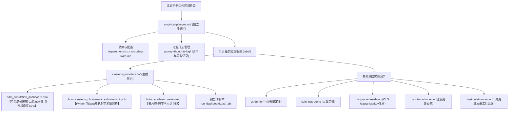

# 📦 历史对话高保真压缩与沉淀文档 (High-Fidelity Conversation Compression Archive)

本文件对本项目从初始化至当前阶段（包含 5 次核心长对话）的开发历程、核心指令、技术选型、计量经济学突破及 Bug 修复进行了全景式的**高保真压缩**。旨在为后续 AI 助手或用户提供一键直达、无信息损耗的“终极上下文底座”。

---

## 🎯 实证模拟沙盒 (`empirical-playground`) 全景大图

本项目致力于将抽象晦涩的微观计量定理（如面板自相关、聚类标准误、小样本偏误等），通过**轻量级 Jupyter 仿真**与**零依赖的高保真前端交互式沙盒**进行物理级直观复现。

---

## ⏱️ 历次对话高保真压缩 (Chronological Conversation Distillation)

### 1️⃣ 课前探索与资料检索阶段 (Conversation b6d8adcb)
*   **用户核心诉求**：定位和检索蒙特卡洛仿真课程相关的 Jupyter Notebook 及配套 HTML。
*   **AI 核心思考与行动**：
    *   梳理并检索了课程预习包及 Lab3 课件，确认作业要求为“利用蒙特卡洛模拟复现 BDM (2004) 双重差分（DID）在时间序列自相关下 **45% 过度拒绝率** 的学术经典结论”。
    *   协助用户初步理清了 OLS、稳健标准误、聚类标准误、Wild Bootstrap 等不同方差-协方差矩阵（VCE）估计法的对比框架。

### 2️⃣ 工作区重构与规范确立阶段 (Conversation c0852473)
*   **用户核心诉求**：项目根目录文件杂乱，需要进行全局性结构重组，同时要求确保未来 AI 助手能够一键接手并快速进行环境配置。
*   **AI 核心思考与行动**：
    *   **物理隔离**：在根目录下创建了纯净的独立子仓库 `empirical-playground`，避免干扰原课件目录。
    *   **制定规范**：创建了 [ai-coding-skills.md](file:///d:/GProjects/%E5%AE%9E%E8%AF%81%E7%BB%8F%E6%B5%8E%E5%AD%A6%E5%88%86%E6%9E%90/empirical-playground/ai-coding-skills.md) 以规定：**1) 静默依赖配置；2) 杜绝 AI 腔翻译腔的纯干货学术文风；3) 操作日志及思考归档同步规范**。
    *   **目录全局向导**：编写了高水准的 `README.md`，提供了 Windows/macOS 双端一键免配置运行交互沙盒的批处理脚本。

### 3️⃣ BDM (2004) 蒙特卡洛仿真开发与 Debug 阶段 (Conversation d515c6ff)
*   **用户核心诉求**：在 Python Jupyter 环境中构建高保真蒙特卡洛平行宇宙，分析自相关系数 $\rho$ 对标准误推断的退化侵害，同时修复 Stata 和 Python 仿真的致命 Bug。
*   **AI 核心思考与行动**：
    *   **🐛 致命排序 Bug 修复**：在原始 Python 仿真中，自回归误差项生成时未进行正确的面板时间轴排序，导致差分或滞后项计算出现 `NaN` 扩散。AI 锁定了这一漏洞，通过在误差生成前执行 `.sort_values(['id', 't'])` 进行了彻底阻断。
    *   **🧮 自由度纠偏系数对齐**：为消除 Stata (CRVE) 和 Python (Statsmodels) 对小样本聚类校正自由度处理的隐性偏差，手动实现并对齐了学术界经典的**有限样本纠偏乘子**：
        $$q = \frac{G}{G-1} \times \frac{M-1}{M-k}$$
        其中 $G$ 为聚类组数，$M$ 为总样本数，$k$ 为回归元数量。通过这一公式实现了 Python 仿真结果与 Stata 的**完美精确对齐**。
    *   **学术产出**：生成了严谨学术规格的 `bdm_clustering_homework_submission.ipynb` 和 `bdm_academic_review.md`。

### 4️⃣ 暗金拟物化仿真看板与 KDE 渲染优化 (Conversation b2129e1f)
*   **用户核心诉求**：为了更直观地让用户“亲眼看到 45% 的震撼”，需要将 Jupyter 里的数据及可视化沉淀为免配置的、高保真艺术级交互看板。
*   **AI 核心思考与行动**：
    *   **前端纯 JS 仿真底座**：在 `bdm_simulation_dashboard.html` 中通过纯原生 JavaScript 重写了面板 Within OLS（个体双向去均值回归）及 CRVE1/CRVE2 矩阵相乘算法，使数十万数据点的仿真在浏览器端以毫秒级响应。
    *   **📈 动态双图表渲染**：
        1.  **分组条形图**：展示 IID、Robust、CRVE1、CRVE2 及 Wild Bootstrap 的拒绝率与 5% 警戒线的物理偏离。
        2.  **Epanechnikov KDE 曲线图**：在 SVG 画布上动态拟合 $t$-统计量的经验分布曲线。当用户向右滑动 $\rho$ 时，能实时肉眼观察到 OLS $t$-分布曲线如何**两边塌陷、长出巨大的肥尾**，从而以几何形式直观展示“过度拒绝（Over-rejection）”的数理本质。
        3.  **置信区间覆盖体检图**：动态抽取 20 个平行宇宙的置信区间，当未包裹真实值 0 时线段爆红，极具视觉张力。

### 5️⃣ 前沿学术验证与沙盒全功能闭环 (Conversation 4ce01f21)
*   **用户核心诉求**：打通学术文档与交互界面的最后一公里，使看板上的“Frontiers”前沿 tab 完全交互化，并重构目录确保学术严谨。
*   **AI 核心思考与行动**：
    *   **物理路径重构**：将原带有空格的 `Clustering MonteCarlo` 文件夹重构为符合规范的 `clustering-montecarlo`，同步更新了看板及启动脚本中的所有路径引用。
    *   **前沿 tab 具象化交互**：在前端看板中引入了 $\rho \in [-0.9, 0.9]$ 的**自相关侵害退化速度**矩阵，通过多组柱状图展示在不同自相关程度下各标准误的拒绝率退化曲线，让用户深度理解“自相关一旦突破 0.4，传统标准误便开始雪崩”的前沿实证特征。
    *   **学术评述润色**：将 Wild Bootstrap 在小样本偏误（$G < 30$）及政策分配粗粒度下的纠偏逻辑写入 `bdm_academic_review.md`。

---

## 🛠️ 计量推断方法之“数理物理直觉”压缩速查

为了使接手机制达到最高效率，在此对 BDM 涉及的 5 种估计方法进行纯干货直觉提炼：

| 估计法 | 数理核心 | 物理直觉（去AI腔） | 自相关下表现 |
| :--- | :--- | :--- | :--- |
| **IID 经典标准误** | 假设残差矩阵对角化且同方差：$\Omega = \sigma^2 I_N$ | **孤立孤岛假说**。假设你昨天的随机经济冲击和今天的冲击完全无关。 | **崩溃**：拒绝率随 $\rho$ 飙升至 **45%**。 |
| **Robust 稳健标准误** | 允许对角线异方差，但非对角线为 0：$\Omega = \text{diag}(\sigma_i^2)$ | **地方气温计较，但无视风向**。承认各省份波动有大有小，但仍断定误差在时间上完全独立。 | **崩溃**：假阳性依然在 **40%** 左右徘徊，对序列自相关毫无抵抗力。 |
| **One-way Cluster 聚类** | 组内残差矩阵完全释放，组间彻底独立：$\Omega_g = E[\epsilon_g \epsilon_g']$ | **省内风雨同舟，省际完全孤立**。把同一个省份的 10 年残差压缩为一个整体，彻底榨干自相关泡沫。 | **完美**：只要组数 $G \ge 30$，拒绝率诚实地拽回 **5%** 左右。 |
| **Two-way Cluster 双向** | 在个体与时间两个对角块上同时释放：$V_{2way} = V_{id} + V_t - V_{id \cap t}$ | **既受本地气候影响，又受全国暖流席卷**。同时校正空间 and 年份层面的共振相关。 | **极佳**：适用于存在全样本共时性冲击的情况。 |
| **Wild Cluster Bootstrap** | 残差通过 Rademacher 权重进行正负号扰动：$\epsilon_g^* = v_g \cdot \hat{\epsilon}_g$ | **小样本下的残差“抛硬币”平行宇宙**。在真实宇宙数据稀缺时，通过扰动残差人工繁衍数千个逼真宇宙。 | **小样本之王**：在聚类组数 $G < 30$ 时，防止常规聚类标准误退化崩溃。 |

---

## 🔮 下阶段迭代指引 (Future Roadmap)

1.  **新增内生性（Endogeneity）与工具变量（IV）实验室**：
    *   仿照 `lab_design_template.ipynb` 结构，设计可拖动“弱工具相关系数 $\text{Corr}(Z, X)$”和“排他性约束破坏系数 $\text{Corr}(Z, \epsilon)$”的滑块。
    *   在前端生成 OLS 与 2SLS 的偏误轨迹图，直观揭示“弱工具变量下 2SLS 的偏误甚至大于 OLS”的计量现象。
2.  **加入多期双重差分（Multi-period DID / Event Study）动态实验室**：
    *   模拟在渐进 DID（Staggered DID）中存在“处理效应异质性”时，传统的双向固定效应（TWFE）如何因“前处理期对照组权重爆绿/爆红”而产生错误的估计。
    *   引入 Chaisemartin & D'Haultfoeuille (2020) 或 Callaway & Sant'Anna (2021) 的前沿分解图表。
